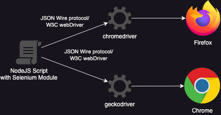

# Demo for Selenium with nodejs

Mocha is a feature-rich JavaScript testing framework that runs on Node.js and in the browser. It provides a simple and flexible way to write unit and integration tests for your application. Selenium, on the other hand, is a popular open-source testing framework for web applications. It allows you to automate web browsers and simulate user interactions.

When combined, Mocha and Selenium can provide a powerful solution for testing web applications. Mocha allows you to write tests in a BDD or TDD style, while Selenium provides a way to interact with the web browser and simulate user actions. This combination enables you to test the functionality and user interface of your web application across different browsers and platforms.

This test will run simultaneously on Firefox and Chrome.

To test this Framework, I'm using this example ecommerce website: https://github.com/adrianhajdin/ecommerce_sanity_stripe

the test cases are:

1. Check if the cart is empty 
2. Add an item to the cart and check if the item is in the cart
3. Add an item to the cart, remove it from the cart, and check if the cart is empty

if the test fails, it will give you an error and will take a screenshot of the webpage

## Install the webdriver

First, we need to install Mozilla Firefox and Google Chrome and then we need to install the webdriver
```bash
$ npm install geckodriver
$ npm install chromedriver
```

## Mocha
Then we will install the mocha testing framework
```bash
$ npm install mocha
```


## Running the tests
To run the test use this command (it is defined in the package.json)
```bash
$ npm test
```